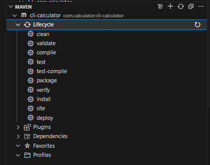

# Command line calculation

## Info

Maven is a build tool used by Java developers, used to help us with common tasks such as compile code, test, deploy and manage the dependencies. Since it's released in 2004, it has been incredibly influential and established a standard for how to setup projects in Java.

Getting comfortable working with Maven is essential, so today we are going to make a small command line application, using VS Code and the Maven cli. We will NOT be using IntelliJ today!

## What you will be working on

You'll be building a Maven project from scratch to create a CLI calculator that can perform basic arithmetic operations. It will be clunky and virtually no-one does it this way anymore, but doing it the manual way gives us more understanding of what our IDEs are doing for us.

These labs are made to not hold your hand 100% of the time, so it's nothing unusual if you get stuck or do not know how to proceed immediately. Remember that you can always ask for help, look up guides online and take a break. Only thing we do not recommend is asking AI, since that will ruin the exercise.

## Setup

Ensure you have the following tools installed:

- [Java Development Kit \(JDK\)](https://www.oracle.com/java/technologies/downloads/#jdk20-windows)
- Apache Maven
- [VS Code Java Extension Pack](https://marketplace.visualstudio.com/items?itemName=vscjava.vscode-java-pack)

## Resources

- [Maven in 5 minutes](https://maven.apache.org/guides/getting-started/maven-in-five-minutes.html)
- [How to install Maven on Windows](https://phoenixnap.com/kb/install-maven-windows)
- [Make a new Java project via the cli](https://www.geeksforgeeks.org/create-a-new-maven-project-from-command-prompt/)

## Lab instructions

The end goal of this lab is to be able to run the following commands
```bash
java -cp <jar-file> <class-path> <arguments>
> <result>

# Examples
java -cp .target/my-compiled-file.jar se.saltcode.App 1 2 add
> 3
java -cp .target/my-compiled-file.jar se.saltcode.App 9 2 multiply
> 18
java -cp .target/my-compiled-file.jar se.saltcode.App 3 2 subtract
> 1
java -cp .target/my-compiled-file.jar se.saltcode.App 10 2 divide
> 5
```

Goof luck!

### Creating our Maven project

1. In your terminal, navigate to your preferred directory and create a new Maven project via the CLI command:  
`mvn archetype:generate DarchetypeArtifactId=maven-archetype-quickstart`  
*ps. you will need to give it some additional arguments, look at the links above ;-)*  

1. Navigate into the new project directory, add the .gitignore file from this repo [.gitignore](.gitignore) and then make the project into a new `git` repo via the command `git init`

1. Then, open up the project with `code .`

### Creating a CLI Calculator

*Tip! Remember to commit small and often as you go! Building up good git routines*  
If you are getting errors from Maven that your current version of Java is not suppported, you can change it by adding the following:
```xml
<properties>
  <maven.compiler.source>20</maven.compiler.source>
  <maven.compiler.target>20</maven.compiler.target>
</properties>
```

#### Let's get started:

1. Create a new Class named `Calculator` in the `src/main/java/<your>/<group>` directory.

1. In this new class, implement a few basic arithmetic operations for addition, subtraction, multiplication, and division. As [static methods](https://www.geeksforgeeks.org/static-method-in-java-with-examples/)

1. Once these methods are in place, it's time to parse user arguments. To see how, we can look at the command we are going to run later:  
`java -cp <jar-file> <class-path> 10 2 divide`  
The `10`, `2` and `divide` WILL be available as Strings in the `String[] args` array inside the main class. Use these arguments to select the correct method, use the correct parameters and print the result.

1. When all other things are in place, it's time to compile. Use the command `mvn package` to create your java application.

1. And now, finally, we should now have a `.jar` file available. Target it and run the application with the `java -cp` command from before!

## Conclusion

Great going! We have dipped you toes in the Maven ocean, and crested and compiled a java project without any help of other additional software. If you look at the bottom of your file browser in in VS-Code, you can see that there are a lot more commands that can be used.



We will explore these more and more as we proceed. Next lab in specific will take a look at testing! Look forward to it!
